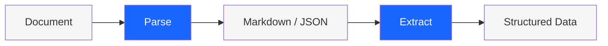

## What is xParse?

xParse turns PDFs, images, and Office documents into structured data. Get clean Markdown for LLMs, extract specific fields with JSON Schema, or retrieve document elements with coordinates.

---

## Choose your workflow

<CardGroup cols={2}>
  <Card title="Parse" icon="file-lines" href="/xparse/v1/quickstart">
    Convert entire documents into Markdown and JSON. Preserves structure—headings, tables, formulas, reading order—so your LLM gets clean, organized input.
    
    **Use when you need:**
    - Full document content for RAG or search
    - Structured elements with coordinates
    - Tables, images, and formulas preserved
  </Card>
  
  <Card title="Extract" icon="table" href="/xparse/extract-quickstart-v3">
    Pull out just the data you need. Define your schema, get structured JSON back. No parsing the whole document—just your invoice totals, form fields, or table rows.
    
    **Use when you need:**
    - Specific fields from forms or invoices
    - Data formatted for your database
    - Fast extraction without full parsing
  </Card>
</CardGroup>

---

## How it works

1. **Upload** your document (PDF, image, Office file)
2. **Parse** converts it to Markdown and structured JSON
3. **Extract** pulls specific data using your schema (optional)
4. **Use** the structured output in your application

---

## Supported formats

- **PDF** — Digital or scanned
- **Images** — PNG, JPEG, WebP, BMP, TIFF
- **Word** — DOC, DOCX
- **Excel** — XLS, XLSX, CSV
- **PowerPoint** — PPT, PPTX
- **HTML** — HTML, MHTML
- **Text** — TXT, RTF, OFD

See [Supported Files & Limits](/xparse/supported-files) for detailed requirements.

## Common use cases

- Build RAG systems with clean document input
- Extract invoice data for accounting automation
- Convert research papers to searchable Markdown
- Pull form fields from scanned documents
- Process receipts at scale

---

## Get started

<CardGroup cols={3}>
  <Card title="Get credentials" icon="key" href="/xparse/authentication">
    Sign up and get your API keys
  </Card>
  
  <Card title="Parse a document" icon="file-code" href="/xparse/parse/quickstart">
    Convert document to Markdown
  </Card>
  
  <Card title="Extract data" icon="table-cells" href="/xparse/extract/quickstart">
    Pull specific fields with schema
  </Card>
</CardGroup>
