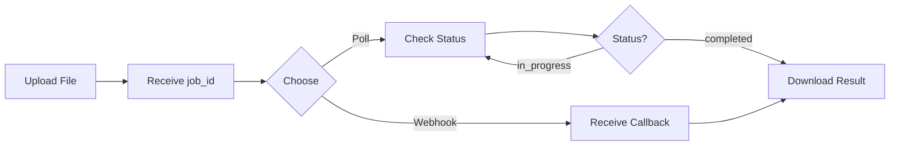

Use async parsing for large documents, batch processing, and production workflows.

## When to use async

Use async parsing when:

<CardGroup cols={2}>
  <Card title="Large files" icon="file-arrow-up">
    Files over 50 pages or 10MB to avoid HTTP timeouts
  </Card>
  
  <Card title="Batch processing" icon="layer-group">
    Process multiple documents in parallel
  </Card>
  
  <Card title="Webhooks" icon="webhook">
    Get notified when processing completes (no polling needed)
  </Card>
  
  <Card title="Long workflows" icon="clock">
    Complex processing that takes over 60 seconds
  </Card>
</CardGroup>

<Note>
  **Sync vs Async limits:**
  - Sync API: 500 pages max, 2-minute timeout
  - Async API: 2000 pages (paid), 5000 pages (enterprise)
</Note>

---

## How it works



**Three steps:**
1. **Create job** → Get `job_id`
2. **Wait for completion** → Poll status or use webhook
3. **Download result** → Fetch from `result_url`

---

## Step 1: Create async job

Submit a file for async processing.

<Tabs>
  <Tab title="Python">
    ```python
    from xparse_client import XParseClient

    client = XParseClient()

    # Create async job
    with open("large_document.pdf", "rb") as f:
        job = client.parse.async_run(
            file=f,
            filename="large_document.pdf"
        )

    job_id = job.job_id
    print(f"Job created: {job_id}")
    ```
  </Tab>

  <Tab title="cURL">
    ```bash
    curl -X POST "https://api.textin.com/api/v1/xparse/parse/async" \
      -H "x-ti-app-id: YOUR_APP_ID" \
      -H "x-ti-secret-code: YOUR_SECRET_CODE" \
      -F "file=@large_document.pdf"
    ```
  </Tab>

  <Tab title="Python (requests)">
    ```python
    import requests

    response = requests.post(
        "https://api.textin.com/api/v1/xparse/parse/async",
        headers={
            "x-ti-app-id": "YOUR_APP_ID",
            "x-ti-secret-code": "YOUR_SECRET_CODE"
        },
        files={"file": open("large_document.pdf", "rb")}
    )

    job_id = response.json()["data"]["job_id"]
    print(f"Job created: {job_id}")
    ```
  </Tab>
</Tabs>

### Response

```json
{
  "code": 200,
  "message": "success",
  "data": {
    "job_id": "job_x9k2m",
    "status": "pending"
  }
}
```

---

## Step 2: Check status

### Option A: Polling (Simple)

Poll the status endpoint until completion.

<Tabs>
  <Tab title="Python">
    ```python
    import time

    # Poll every 5 seconds
    while True:
        status = client.parse.get_async_status(job_id)
        
        print(f"Status: {status.status}")
        
        if status.status == "completed":
            result_url = status.result_url
            print(f"Complete! Result: {result_url}")
            break
        elif status.status == "failed":
            print(f"Failed: {status.message}")
            break
        
        time.sleep(5)
    ```
  </Tab>

  <Tab title="cURL">
    ```bash
    curl -X GET "https://api.textin.com/api/v1/xparse/parse/async/job_x9k2m" \
      -H "x-ti-app-id: YOUR_APP_ID" \
      -H "x-ti-secret-code: YOUR_SECRET_CODE"
    ```
  </Tab>

  <Tab title="Python (requests)">
    ```python
    import time
    import requests

    headers = {
        "x-ti-app-id": "YOUR_APP_ID",
        "x-ti-secret-code": "YOUR_SECRET_CODE"
    }

    while True:
        response = requests.get(
            f"https://api.textin.com/api/v1/xparse/parse/async/{job_id}",
            headers=headers
        )
        
        data = response.json()["data"]
        status = data["status"]
        
        print(f"Status: {status}")
        
        if status == "completed":
            result_url = data["result_url"]
            print(f"Complete! Result: {result_url}")
            break
        elif status == "failed":
            print(f"Failed: {data.get('message')}")
            break
        
        time.sleep(5)
    ```
  </Tab>
</Tabs>

### Status values

| Status | Description |
|--------|-------------|
| `pending` | Job queued, not started yet |
| `in_progress` | Currently processing |
| `completed` | Processing finished successfully |
| `failed` | Processing failed (check `message` for details) |

### Status response

```json
{
  "code": 200,
  "data": {
    "job_id": "job_x9k2m",
    "status": "completed",
    "result_url": "https://api.textin.com/api/v1/xparse/result/job_x9k2m",
    "created_at": "2024-01-15T10:30:00Z",
    "completed_at": "2024-01-15T10:35:00Z"
  }
}
```

---

### Option B: Webhooks (Recommended)

Get notified when processing completes—no polling needed.

#### Set webhook URL

Include `webhook` parameter when creating the job:

<Tabs>
  <Tab title="Python">
    ```python
    job = client.parse.async_run(
        file=f,
        filename="document.pdf",
        webhook="https://your-server.com/webhook"
    )
    ```
  </Tab>

  <Tab title="cURL">
    ```bash
    curl -X POST "https://api.textin.com/api/v1/xparse/parse/async" \
      -H "x-ti-app-id: YOUR_APP_ID" \
      -H "x-ti-secret-code: YOUR_SECRET_CODE" \
      -F "file=@document.pdf" \
      -F "webhook=https://your-server.com/webhook"
    ```
  </Tab>
</Tabs>

#### Webhook payload

When processing completes, you'll receive a POST request:

```json
{
  "job_id": "job_x9k2m",
  "status": "completed",
  "result_url": "https://api.textin.com/api/v1/xparse/result/job_x9k2m",
  "created_at": "2024-01-15T10:30:00Z",
  "completed_at": "2024-01-15T10:35:00Z"
}
```

#### Handle webhook

<Tabs>
  <Tab title="Flask">
    ```python
    from flask import Flask, request
    import requests

    app = Flask(__name__)

    @app.route('/webhook', methods=['POST'])
    def handle_webhook():
        data = request.json
        
        if data['status'] == 'completed':
            # Download result
            result_url = data['result_url']
            result = requests.get(
                result_url,
                headers={
                    "x-ti-app-id": "YOUR_APP_ID",
                    "x-ti-secret-code": "YOUR_SECRET_CODE"
                }
            )
            
            # Process result
            markdown = result.json()["markdown"]
            print(f"Got result: {len(markdown)} chars")
        
        return {"status": "ok"}
    ```
  </Tab>

  <Tab title="FastAPI">
    ```python
    from fastapi import FastAPI, Request
    import httpx

    app = FastAPI()

    @app.post("/webhook")
    async def handle_webhook(request: Request):
        data = await request.json()
        
        if data['status'] == 'completed':
            # Download result
            async with httpx.AsyncClient() as client:
                response = await client.get(
                    data['result_url'],
                    headers={
                        "x-ti-app-id": "YOUR_APP_ID",
                        "x-ti-secret-code": "YOUR_SECRET_CODE"
                    }
                )
                
                result = response.json()
                markdown = result["markdown"]
                print(f"Got result: {len(markdown)} chars")
        
        return {"status": "ok"}
    ```
  </Tab>

  <Tab title="Express.js">
    ```javascript
    const express = require('express');
    const axios = require('axios');

    const app = express();
    app.use(express.json());

    app.post('/webhook', async (req, res) => {
      const data = req.body;
      
      if (data.status === 'completed') {
        // Download result
        const result = await axios.get(data.result_url, {
          headers: {
            'x-ti-app-id': 'YOUR_APP_ID',
            'x-ti-secret-code': 'YOUR_SECRET_CODE'
          }
        });
        
        const markdown = result.data.markdown;
        console.log(`Got result: ${markdown.length} chars`);
      }
      
      res.json({status: 'ok'});
    });

    app.listen(3000);
    ```
  </Tab>
</Tabs>

<Tip>
  **Webhook best practices:**
  - Return 200 OK quickly (process result asynchronously)
  - Implement retry logic for failed webhook deliveries
  - Verify webhook signature (coming soon)
</Tip>

---

## Step 3: Download result

Fetch the full parsing result from `result_url`.

<Tabs>
  <Tab title="Python">
    ```python
    # Download result
    result = client.parse.get_async_result(job_id)

    # Use the result
    print(result.markdown)
    print(f"Parsed {len(result.elements)} elements")
    ```
  </Tab>

  <Tab title="cURL">
    ```bash
    curl -X GET "https://api.textin.com/api/v1/xparse/result/job_x9k2m" \
      -H "x-ti-app-id: YOUR_APP_ID" \
      -H "x-ti-secret-code: YOUR_SECRET_CODE"
    ```
  </Tab>

  <Tab title="Python (requests)">
    ```python
    # Get result URL from status
    status_response = requests.get(
        f"https://api.textin.com/api/v1/xparse/parse/async/{job_id}",
        headers=headers
    )
    result_url = status_response.json()["data"]["result_url"]

    # Download result
    result = requests.get(result_url, headers=headers).json()

    # Use the result
    markdown = result["markdown"]
    elements = result["elements"]
    ```
  </Tab>
</Tabs>

### Result format

The result has the same structure as sync parsing:

```json
{
  "markdown": "# Document Title\n\n...",
  "elements": [...],
  "pages": [...],
  "success_count": 50
}
```

See [Response Format](/xparse/v1/response-format) for complete structure.

---

## Complete example

### Polling

```python
import time
from xparse_client import XParseClient

client = XParseClient()

# 1. Create job
with open("large_report.pdf", "rb") as f:
    job = client.parse.async_run(
        file=f,
        filename="large_report.pdf"
    )

job_id = job.job_id
print(f"Job created: {job_id}")

# 2. Poll status
while True:
    status = client.parse.get_async_status(job_id)
    print(f"Status: {status.status}")
    
    if status.status == "completed":
        break
    elif status.status == "failed":
        raise Exception(f"Failed: {status.message}")
    
    time.sleep(5)

# 3. Download result
result = client.parse.get_async_result(job_id)

print(f"Success! Parsed {len(result.elements)} elements")
print(result.markdown[:500])
```

### Webhook

```python
from flask import Flask, request
from xparse_client import XParseClient

app = Flask(__name__)
client = XParseClient()

# 1. Create job with webhook
with open("large_report.pdf", "rb") as f:
    job = client.parse.async_run(
        file=f,
        filename="large_report.pdf",
        webhook="https://your-server.com/webhook"
    )

print(f"Job created: {job.job_id}")

# 2. Handle webhook
@app.route('/webhook', methods=['POST'])
def handle_webhook():
    data = request.json
    
    if data['status'] == 'completed':
        # 3. Download result
        result = client.parse.get_async_result(data['job_id'])
        
        # Process result
        print(f"Parsed {len(result.elements)} elements")
        # Store in database, send to LLM, etc.
    
    return {"status": "ok"}

if __name__ == '__main__':
    app.run()
```

---

## Batch processing

Process multiple documents in parallel.

```python
import asyncio
from xparse_client import XParseClient

client = XParseClient()
files = ["doc1.pdf", "doc2.pdf", "doc3.pdf"]

# Create all jobs
job_ids = []
for filepath in files:
    with open(filepath, "rb") as f:
        job = client.parse.async_run(file=f, filename=filepath)
        job_ids.append(job.job_id)
        print(f"Created job: {job.job_id}")

# Poll all jobs
async def wait_for_job(job_id):
    while True:
        status = client.parse.get_async_status(job_id)
        if status.status == "completed":
            return client.parse.get_async_result(job_id)
        elif status.status == "failed":
            raise Exception(f"Job {job_id} failed")
        await asyncio.sleep(5)

# Wait for all
results = await asyncio.gather(*[wait_for_job(jid) for jid in job_ids])

print(f"Processed {len(results)} documents")
```

---

## Best practices

<AccordionGroup>
  <Accordion title="Use webhooks for production" icon="webhook">
    Webhooks eliminate polling overhead and reduce latency. Implement retry logic for reliability.
  </Accordion>

  <Accordion title="Set appropriate polling intervals" icon="clock">
    Poll every 5-10 seconds for large files. Polling too frequently wastes resources.
  </Accordion>

  <Accordion title="Handle failures gracefully" icon="triangle-exclamation">
    Always check for `status: "failed"` and log the error message. Implement retry with exponential backoff.
  </Accordion>

  <Accordion title="Cache results" icon="database">
    Use `file_id` to cache results. Identical files produce the same `file_id`.
  </Accordion>

  <Accordion title="Process batches in parallel" icon="layer-group">
    Submit multiple jobs at once, then wait for all to complete. Don't wait for each job sequentially.
  </Accordion>
</AccordionGroup>

---

## Error handling

### Failed jobs

```json
{
  "code": 200,
  "data": {
    "job_id": "job_x9k2m",
    "status": "failed",
    "message": "File format not supported"
  }
}
```

**Common failure reasons:**
- Unsupported file format
- File corrupted or unreadable
- Password-protected without password
- Processing timeout (very large files)

### Retry strategy

```python
import time

def create_job_with_retry(file, max_retries=3):
    for attempt in range(max_retries):
        try:
            job = client.parse.async_run(file=file)
            return job.job_id
        except Exception as e:
            if attempt == max_retries - 1:
                raise
            wait_time = 2 ** attempt  # Exponential backoff
            print(f"Retry in {wait_time}s...")
            time.sleep(wait_time)
```

---

## Monitoring

Track job metrics for production monitoring.

```python
from datetime import datetime

# Track processing time
created_at = datetime.fromisoformat(status.created_at)
completed_at = datetime.fromisoformat(status.completed_at)
duration = (completed_at - created_at).total_seconds()

print(f"Processing took {duration} seconds")

# Log for monitoring
logger.info(f"Job {job_id} completed in {duration}s")
```

---

## Related resources

<CardGroup cols={3}>
  <Card title="Async API Reference" icon="book" href="/api-reference/endpoint/xparse/v1/parse-async">
    Complete API specification
  </Card>

  <Card title="Configuration" icon="sliders" href="/xparse/v1/configuration">
    Customize parsing behavior
  </Card>

  <Card title="Examples" icon="code" href="/xparse/v1/examples">
    See async processing in action
  </Card>
</CardGroup>
