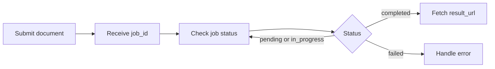

The asynchronous Parse endpoint creates a job and returns a `job_id`. Use that `job_id` to poll the job status and fetch the result after processing completes. If webhooks are enabled for your account or endpoint, you can also receive a webhook notification when the job finishes.

## When to use async

Use the asynchronous API when:

- The document exceeds the recommended threshold for synchronous processing.
- The document is large or complex.
- You are submitting documents in batches.
- You do not need the result returned in the original request.
- You want to retrieve the result later through polling or a webhook.

<Info>
  For page limits, file size limits, concurrency limits, and processing time limits, see [Supported Files & Limits](/xparse/supported-files).
</Info>

## How it works



1. **Create a job**: Submit a document and receive a `job_id`.
2. **Wait for completion**: Poll the status endpoint or wait for a webhook notification.
3. **Fetch the result**: Download the parsed result from `result_url` after the job is completed.

## Step 1: Create an async job

<CodeGroup>

```python Python (requests)
import os
import requests

with open("large_document.pdf", "rb") as file:
    response = requests.post(
        "https://api.textin.ai/api/v1/xparse/parse/async",
        headers={
            "x-ti-app-id": os.environ["TEXTIN_APP_ID"],
            "x-ti-secret-code": os.environ["TEXTIN_SECRET_CODE"],
        },
        files={"file": ("large_document.pdf", file)},
    )

job_id = response.json()["data"]["job_id"]
print(job_id)
```

```bash cURL
curl -X POST "https://api.textin.ai/api/v1/xparse/parse/async" \
  -H "x-ti-app-id: $TEXTIN_APP_ID" \
  -H "x-ti-secret-code: $TEXTIN_SECRET_CODE" \
  -F "file=@large_document.pdf"
```

</CodeGroup>

### Response

```json
{
  "code": 200,
  "message": "success",
  "data": {
    "job_id": "job_x9k2m"
  }
}
```

## Step 2: Check job status

Poll the status endpoint until the job is completed or failed.

<CodeGroup>

```python Python (requests)
import os
import time
import requests

while True:
    response = requests.get(
        f"https://api.textin.ai/api/v1/xparse/parse/async/{job_id}",
        headers={
            "x-ti-app-id": os.environ["TEXTIN_APP_ID"],
            "x-ti-secret-code": os.environ["TEXTIN_SECRET_CODE"],
        },
    )
    data = response.json()["data"]

    if data["status"] == "completed":
        print(data["result_url"])
        break

    if data["status"] == "failed":
        raise RuntimeError(response.json()["message"])

    time.sleep(15)
```

```bash cURL
curl -X GET "https://api.textin.ai/api/v1/xparse/parse/async/job_x9k2m" \
  -H "x-ti-app-id: $TEXTIN_APP_ID" \
  -H "x-ti-secret-code: $TEXTIN_SECRET_CODE"
```

</CodeGroup>

### Status values

| Status | Description |
| --- | --- |
| `pending` | Job is queued and has not started |
| `in_progress` | Job is being processed |
| `completed` | Job completed successfully |
| `failed` | Job failed |

### Status response

While the job is still running, the response typically includes `job_id`, `file_id`, and `status`.

```json
{
  "code": 200,
  "message": "success",
  "data": {
    "job_id": "job_x9k2m",
    "file_id": "doc_7f3a2b",
    "status": "in_progress"
  }
}
```

After the job is completed, the response includes `result_url`:

```json
{
  "code": 200,
  "message": "success",
  "data": {
    "job_id": "job_x9k2m",
    "file_id": "doc_7f3a2b",
    "status": "completed",
    "result_url": "https://web-api.textin.ai/file/xparse_result/xxxx.json"
  }
}
```

## Step 3: Download the result

After the job is completed, download the result from `result_url`.

```python
import os
import requests

response = requests.get(
    result_url,
    headers={
        "x-ti-app-id": os.environ["TEXTIN_APP_ID"],
        "x-ti-secret-code": os.environ["TEXTIN_SECRET_CODE"],
    },
)

result = response.json()
print(result["markdown"])
```

<Note>
  The downloaded payload contains the parse result object directly, without the outer `code` / `message` / `data` wrapper used by the synchronous endpoint. See [Response Format](/xparse/parse/response-format).
</Note>

## Webhooks

If webhooks are enabled for your account or endpoint, include a `webhook` URL when creating the job.

```bash
curl -X POST "https://api.textin.ai/api/v1/xparse/parse/async" \
  -H "x-ti-app-id: $TEXTIN_APP_ID" \
  -H "x-ti-secret-code: $TEXTIN_SECRET_CODE" \
  -F "file=@document.pdf" \
  -F "webhook=https://your-server.com/webhook"
```

When the job completes, the webhook receives a `POST` request similar to:

```json
{
  "job_id": "job_x9k2m",
  "file_id": "doc_7f3a2b",
  "status": "completed",
  "result_url": "https://web-api.textin.ai/file/xparse_result/example-result.json"
}
```

Your server should validate and process the webhook payload, then fetch the final result from `result_url` when needed.

## Batch processing

When processing documents in batches:

- Respect your Parse concurrency limit.
- Add retry logic for failed jobs.
- Use backoff when polling many jobs.
- Store `job_id`, status, timestamps, and file identifiers for monitoring.

Example:

```python
jobs = []

for path in files:
    with open(path, "rb") as file:
        response = requests.post(
            "https://api.textin.ai/api/v1/xparse/parse/async",
            headers=headers,
            files={"file": (path.name, file)},
        )
        jobs.append(response.json()["data"]["job_id"])
```

## Limits

Asynchronous processing supports more pages per job than synchronous processing, but it does not increase the file size limit or the 10-minute processing time limit for an individual job.

See [Supported Files & Limits](/xparse/supported-files) for current limits.

## Error handling

If a job fails:

1. Check the response code and message.
2. Verify that the file type, file size, and page count are supported.
3. Retry transient failures with backoff.
4. Split large or complex documents when needed.
5. Contact TextIn support if the same document fails repeatedly.

## Related resources

<CardGroup cols={2}>
  <Card title="Supported Files & Limits" icon="file" href="/xparse/supported-files">
    Review supported formats and limits.
  </Card>

  <Card title="Parse Quickstart" icon="rocket" href="/xparse/parse/quickstart">
    Parse your first document.
  </Card>

  <Card title="Response Format" icon="code" href="/xparse/parse/response-format">
    Understand the response structure.
  </Card>

  <Card title="Examples" icon="book-open" href="/xparse/parse/examples">
    Explore common implementation patterns.
  </Card>
</CardGroup>
